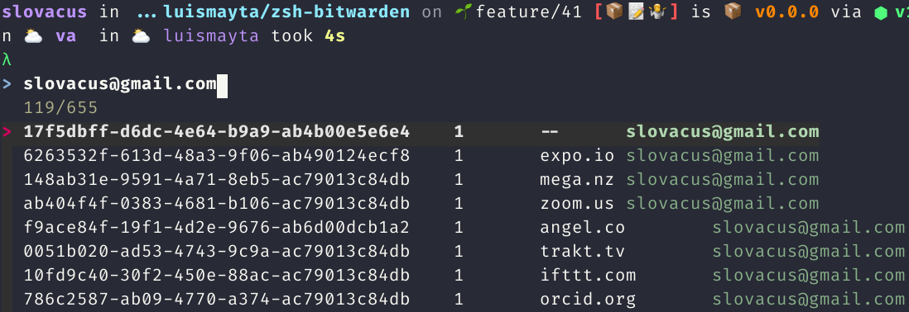

<!--


  ** DO NOT EDIT THIS FILE
  **
  ** 1) Make all changes to `README.yaml`
  ** 2) Run`make readme` to rebuild this file.
  **
  ** (We maintain HUNDREDS of open source projects. This is how we maintain our sanity.)
  **


  -->

 

 [](https://github.com/hadenlabs/zsh-bitwarden/releases) [](https://github.com/hadenlabs/zsh-bitwarden/actions) [](https://github.com/hadenlabs/zsh-bitwarden/issues) [](https://conventionalcommits.org) [](https://keepachangelog.com) [](https://github.com/hadenlabs/zsh-bitwarden)

# zsh-bitwarden

 zsh-bitwarden plugin for zsh. 


## Screenshots



*search key with bitwarden*


## Requirements


This is a list of plugins that need to be installed previously to enjoy all the goodies of this configuration:

* [zsh-core](https://github.com/hadenlabs/zsh-core)


## Installation
### [oh-my-zsh](https://github.com/robbyrussell/oh-my-zsh) users

If you're using [oh-my-zsh](https://gitub.com/robbyrussell/oh-my-zsh), install this plugin by doing the following:

1.  Go to your oh-my-zsh custom plugins directory -`cd ~/.oh-my-zsh/custom/plugins`
2.  Clone the plugin `bash git clone https://github.com/hadenlabs/zsh-bitwarden`bash
3.  Edit your `.zshrc` and add `plugins=( ... zsh-bitwarden )` to your list of plugins
4.  Open a new terminal and enjoy!
### [antigen](https://github.com/zsh-users/antigen) users

If you're using [Antigen](https://github.com/zsh-users/antigen), install this plugin by doing the following:

1.  Add `antigen bundle hadenlabs/zsh-bitwarden` to your `.zshrc` where you're adding your other plugins.
2.  Either open a new terminal to force zsh to load the new plugin, or run `antigen bundle hadenlabs/zsh-bitwarden` in a running zsh session.
3.  Enjoy!
### [antibody](https://github.com/getantibody/antibody) users

If you're using [Antibody](https://github.com/getantibody/antibody), install this plugin by doing the following:

1.  Add :

```{.sourceCode .bash}
     antibody bundle hadenlabs/zsh-bitwarden
```

to your `.zshrc` where you're adding your other plugins.

2.  Either open a new terminal to force zsh to load the new plugin, or run `antibody bundle hadenlabs/zsh-bitwarden` in a running zsh session.
3.  Enjoy!


## Usage


Unlock your BitWarden vault:

```
bw unlock
```

Enter your password and then copy the session token into the `BW_SESSION` environment variable:

```
export BW_SESSION="SECRETKEYWILLBEHERE"
```

Sync your local vault with the cloud:

```
bw sync
```

Then run the shortcut:

`CTRL x + k`: run fzf bitwarden


 ## Functions

zsh bitwarden includes a small utility `bitwarden` to fetch and install new packages.

#### `bw::search`

Search key in bitwarden.

#### `bw::load::env`

load var env of list `BITWARDEN_VARS_LIST` var environment.


## Help

**Got a question?**

File a GitHub [issue](https://github.com/hadenlabs/zsh-bitwarden/issues).

## Contributing

### Bug Reports & Feature Requests

Please use the [issue tracker](https://github.com/hadenlabs/zsh-bitwarden/issues) to report any bugs or file feature requests.

### Development

In general, PRs are welcome. We follow the typical "fork-and-pull" Git workflow.

1.  **Fork** the repo on GitHub
2.  **Clone** the project to your own machine
3.  **Commit** changes to your own branch
4.  **Push** your work back up to your fork
5.  Submit a **Pull Request** so that we can review your changes

**NOTE:** Be sure to rebase the latest changes from "upstream" before making a pull request!

## Module Versioning

This Module follows the principles of [Semantic Versioning (SemVer)](https://semver.org/).

Using the given version number of `MAJOR.MINOR.PATCH`, we apply the following constructs:

1. Use the `MAJOR` version for incompatible changes.
1. Use the `MINOR` version when adding functionality in a backwards compatible manner.
1. Use the `PATCH` version when introducing backwards compatible bug fixes.

### Backwards compatibility in `0.0.z` and `0.y.z` version

- In the context of initial development, backwards compatibility in versions `0.0.z` is **not guaranteed** when `z` is
  increased. (Initial development)
- In the context of pre-release, backwards compatibility in versions `0.y.z` is **not guaranteed** when `y` is
  increased. (Pre-release)


## Copyright

Copyright © 2018-2021 [Hadenlabs](https://hadenlabs.com)


## Trademarks

All other trademarks referenced herein are the property of their respective owners.


## License

The code and styles are licensed under the LGPL-3.0 license [See project license.](LICENSE).


## Don't forget to 🌟 Star 🌟 the repo if you like zsh-bitwarden

[Your feedback is appreciated](https://github.com/hadenlabs/zsh-bitwarden/issues)
